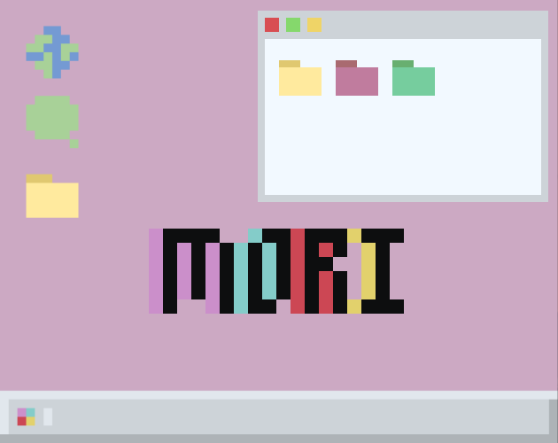
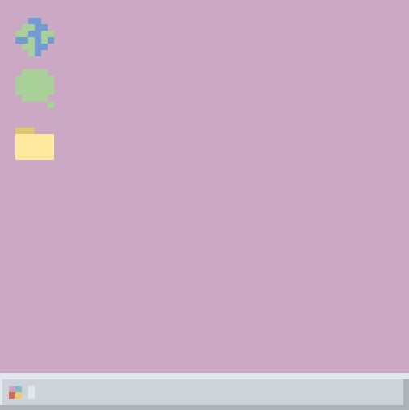
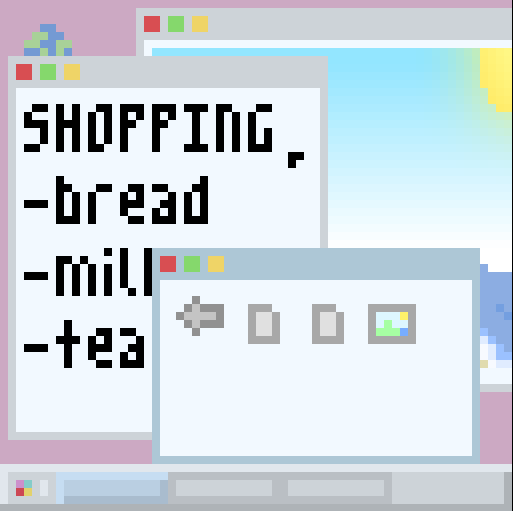

[**MORI**](https://chiyeon.itch.io/mori) is a tiny computer simulation game made in under 24 hours in a 64x64 canvas for LOWREZJAM 2021.

In it, you are called into fix a strange customer's PC. Squash all the bugs you can find! There are 6 endings and 2 secret endings, so keep an eye out for odd words and places to put them.

### Previews

